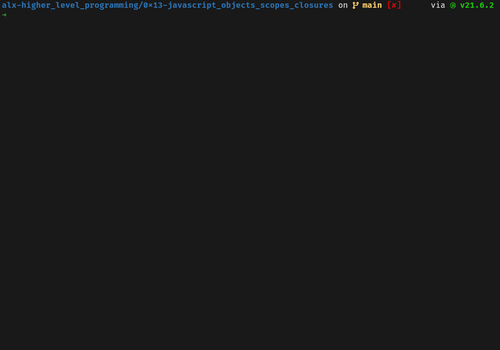

# 0x13. JavaScript - Objects, Scopes and Closures

In the following tasks using the `class` keyword is a rule unless explicitly
said otherwise.

To test the classes you can run the main script corresponding to the task
number. For example to test the class defined in the file`0-rectangle.js`,
run: `./mains/0-main.js`

## Mandatory

[0-rectangle.js](./0-rectangle.js)

- An empty class `Rectangle` that defines a rectangle.

[1-rectangle.js](./1-rectangle.js)

- A class `Rectangle` that has `width` and `height` properties.

[2-rectangle.js](./2-rectangle.js)

- Continuing on from `1-rectangle.js`:
- Add validation that checks the `width` or `height` passed to the constructor
  are non-zero positive integers only, otherwise it returns an empty object.

[3-rectangle.js](./3-rectangle.js)

- Continuing on from `2-rectangle.js`:
- Add a method `print()` that prints the rectangle using the character `X`.

[4-rectangle.js](./4-rectangle.js)

- Continuing on from `3-rectangle.js`:
- Add a method `rotate()` that exchanges the `width` and `height` of the rectangle.
- Add a method `double()` that doubles the `width` and `height` by 2.

[5-square.js](./5-square.js)

- A class `Square` that defines a square and inherits from `Rectangle` of `4-rectangle.js`

[6-square.js](./6-square.js)

- A class `Square` that defines a square and inherits from `Square` of `5-square.js`.
- Add a method called `charPrint(c)` that prints the square using the character
  `c`, or `X` if `c` is `undefined`.

[7-occurrences.js](./7-occurrences.js)

- A function that returns the number of occurrences in a list (Array).

[8-esrever.js](./8-esrever.js)

- A function that returns the reversed version of a list (Array).
- Using the built in method `reverse` is not allowed.

[9-logme.js](./9-logme.js)

- A function that prints the number of arguments already printed and the new
  argument value.

[10-converter.js](./10-converter.js)

- A function that converts a number from base 10 to another base passed as argument.
- Declaring a new variable is not allowed (`var`, `let`, etc...).

## Advanced

[100-map.js](./100-map.js)

- A script that imports an array and computes a new array.
- Requirements:
  - Using `map` is a must.
  - The script must import `list` from the file [100-data.js](./100-map.js).
  - A new list must be created with each value equal to the value of the
    initial list, multiplied by the index in the list.
  - Both the initial list and the new list must be printed.

[101-sorted.js](./101-sorted.js)

- A script that imports a dictionary of occurrences by user id and computes
  a dictionary of user ids by occurrence.
- Requirements:
  - The script must import `dict` from the file [101-data.js](./101-data.js).
  - In the new dictionary:
    - A key is a number of occurrences
    - A value is the list of user ids
  - The new dictionary must be printed at the end

[102-concat.js](./102-concat.js)

- A script that concatenates 2 files.
- Requirements:
  - The first argument is the file path of the first source file.
  - The second argument is the file path of the second source file.
  - The third argument is the file path of the destination.
- e.g.
  
